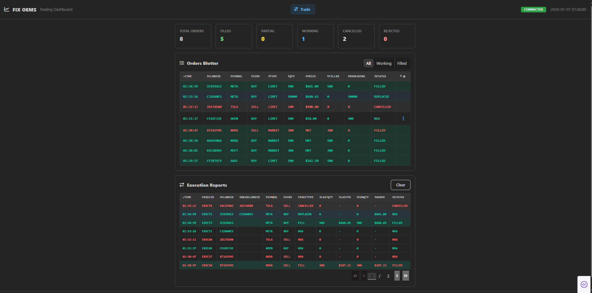
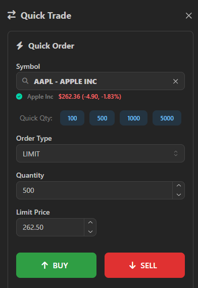
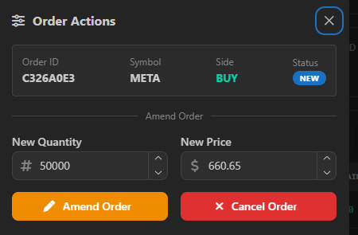
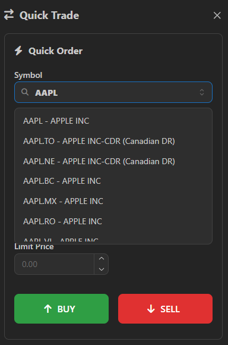
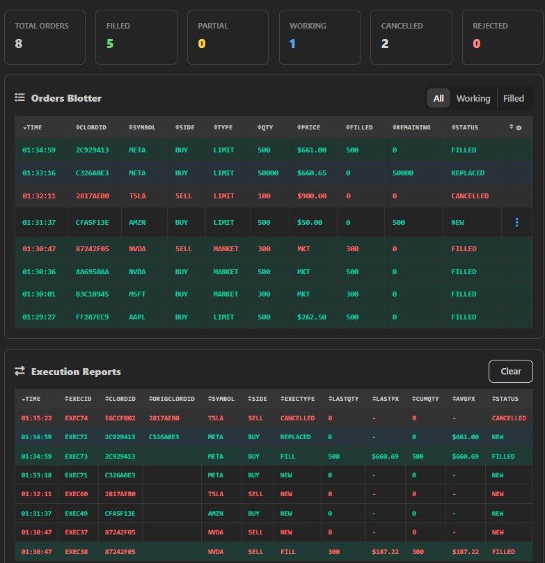

# FIX Trading System

A complete electronic trading platform implementing the FIX 4.4 protocol, featuring a real-time order management UI, matching engine with liquidity simulation, and portfolio monitoring dashboard.

> **This repository is the main entry point for a 4-repository project.** See [Related Repositories](#related-repositories) for the complete system.

<!-- 
SCREENSHOT PLACEHOLDER: Main trading dashboard
- Recommended size: 1200x800px
- Show: Full dashboard with statistics cards, orders blotter with mixed statuses (NEW, FILLED, PARTIAL), executions blotter
- Tip: Have 5-10 orders in various states for visual interest
-->

*Main trading interface showing order entry, blotters, and real-time statistics*

---

## Related Repositories

This trading system consists of four interconnected components:

| Repository                                                                      | Description                                       | Tech Stack | Port |
|---------------------------------------------------------------------------------|---------------------------------------------------|------------|------|
| **[fix-trading-ui](https://github.com/jag2430/fix-trading-ui)** (this repo)     | Order entry & management interface                | Python, Dash, Mantine Components | 8050 |
| **[fix-client](https://github.com/jag2430/fix-client)**                         | FIX protocol middleware & REST API                | Java, Spring Boot, QuickFIX/J, Redis | 8081 |
| **[fix-exchange-simulator](https://github.com/jag2430/fix-exchange-simulator)** | Matching engine with simulated liquidity provider | Java, Spring Boot, QuickFIX/J | 9876 |
| **[portfolio-blotter](https://github.com/jag2430/portfolio-blotter)**           | Real-time P&L monitoring dashboard                | Python, Dash, Redis Pub/Sub | 8060 |

---

## System Architecture

```
┌─────────────────────────────────────────────────────────────────────────────┐
│                           FIX Trading System                                │
├─────────────────────────────────────────────────────────────────────────────┤
│                                                                             │
│  ┌─────────────────┐     ┌─────────────────┐     ┌─────────────────┐        │
│  │ FIX Trading UI  │────>│   FIX Client    │────>│    Exchange     │        │
│  │  (This Repo)    │REST │  (Spring Boot)  │ FIX │   Simulator     │        │
│  │   Dash:8050     │     │     :8081       │ 4.4 │     :9876       │        │
│  └─────────────────┘     └────────┬────────┘     └─────────────────┘        │
│           │                       │                       │                 │
│           │              ┌────────▼────────┐              │                 │
│           │              │     Redis       │<─────────────┘                 │
│           │              │   Pub/Sub +     │   Publishes executions         │
│           │              │    Caching      │                                │
│           │              └────────┬────────┘                                │
│           │                       │                                         │
│           │              ┌────────▼────────┐                                │
│           └─────────────>│Portfolio Blotter│                                │
│              (optional)  │   Dash:8060     │                                │
│                          └─────────────────┘                                │
│                                                                             │
│  External Data:  Finnhub API (real-time prices, symbol search)              │
│                                                                             │
└─────────────────────────────────────────────────────────────────────────────┘
```

---

## Overview

The FIX Trading UI provides a professional trading interface for submitting, monitoring, and managing orders through a FIX protocol-based trading system. It communicates with the FIX Client middleware via REST API and displays real-time order status and execution information.

---

## Features

### Order Entry
- **Order Types**: Support for Market and Limit orders
- **Symbol Search & Autocomplete**: Real-time Finnhub-powered symbol lookup as you type
- **Symbol Validation**: Displays company name, current price, and price change % before order submission
- **Quick Quantity Buttons**: One-click buttons for common sizes (100, 500, 1000, 5000 shares)
- **Dynamic Price Field**: Automatically shows/hides based on order type selection (hidden for Market orders)
- **Side Selection**: Clear BUY (green) and SELL (red) buttons
- **Slide-out Drawer**: Clean order entry panel that doesn't clutter the main view
- **Auto-Dismiss Notifications**: Order confirmations automatically clear after 4 seconds

<!-- 
SCREENSHOT PLACEHOLDER: Order entry drawer with symbol validation
- Recommended size: 800x600px
- Show: Drawer open, symbol searched (e.g., "AAPL"), validation info showing company name and price
- Tip: Show the green checkmark validation state
-->

*Slide-out order entry panel with Finnhub-powered symbol search and validation*

### Order Management
- **Amend Orders**: Modify quantity or price of working orders
- **Cancel Orders**: Cancel any non-filled order
- **Order Actions Menu**: Click the ⋮ (vertical ellipsis) button on any order row to access amendment and cancellation options
- **Order Actions Modal**: Pop-up dialog for confirming amendments or cancellations

<!-- 
SCREENSHOT PLACEHOLDER: Order actions modal
- Recommended size: 500x400px
- Show: Modal open with amend fields (new quantity, new price) for a working order
-->

*Modal dialog for amending or cancelling working orders*

### Real-Time Monitoring

#### Orders Blotter
Live view of all orders with the following columns:

| Column | Description |
|--------|-------------|
| Timestamp | Order submission time |
| ClOrdId | Client order identifier (unique) |
| Symbol | Stock ticker |
| Side | BUY or SELL |
| Type | MARKET or LIMIT |
| Quantity | Order size |
| Price | Limit price (if applicable) |
| Filled | Number of shares filled |
| Remaining | Leaves quantity (unfilled shares) |
| Status | Current order status |
| Actions | Menu button (⋮) for amend/cancel |

#### Executions Blotter
View all execution reports (fills) with:

| Column | Description |
|--------|-------------|
| ExecId | Execution identifier |
| ClOrdId | Related order ID |
| OrigClOrdId | Original order ID (for amend/cancel) |
| Symbol | Stock ticker |
| Side | BUY or SELL |
| ExecType | NEW, FILL, PARTIAL_FILL, CANCELLED, REPLACED, REJECTED |
| LastQty | Shares in this execution |
| LastPx | Price of this execution |
| CumQty | Cumulative filled quantity |
| AvgPx | Average fill price |

#### Statistics Dashboard
At-a-glance metrics displayed in cards at the top of the interface:

| Metric | Description |
|--------|-------------|
| Total Orders | All orders submitted in session |
| Filled | Completely filled orders |
| Partial | Partially filled orders |
| Working | Active orders in the market |
| Cancelled | Cancelled orders |
| Rejected | Rejected orders |

### Connection Status
- **Real-time FIX Session Indicator**: CONNECTED (green badge) / DISCONNECTED (red badge) in header
- **Session Details**: Footer displays active session info (`SenderCompID → TargetCompID`)

### Visual Design
Color-coded rows for quick status recognition:

| Color | Meaning |
|-------|---------|
| Green | BUY side or FILLED status |
| Red | SELL side or REJECTED status |
| Yellow | PARTIAL_FILL status |
| Default | Other statuses |

### Auto-Refresh
- Orders and executions automatically refresh every 500ms (configurable via `REFRESH_MS`)
- No manual refresh needed

---

## Screenshots

### Symbol Search
<!-- 
SCREENSHOT PLACEHOLDER: Symbol search dropdown
- Recommended size: 400x300px
- Show: Symbol input with dropdown showing autocomplete results (e.g., searching "AA" shows AAPL, AAL, etc.)
-->

*Real-time symbol autocomplete powered by Finnhub API*

### Orders Blotter
<!-- 
SCREENSHOT PLACEHOLDER: Orders blotter with various statuses
- Recommended size: 1000x400px
- Show: Multiple orders with different statuses (NEW, FILLED, PARTIAL_FILL, CANCELLED)
- Tip: Include both BUY and SELL orders to show color coding
-->

*Orders blotter with color-coded sides and status highlighting*

### Portfolio Blotter Integration
<!-- 
SCREENSHOT PLACEHOLDER: Portfolio blotter positions tab
- Recommended size: 1000x500px
- Show: Positions table with P&L, pie chart showing allocation
- Note: This screenshot is from the portfolio-blotter repo
-->

*Real-time position monitoring with P&L from the companion Portfolio Blotter application*

---

## Architecture

```
┌─────────────────────────────────────────────────────────────────┐
│                      FIX Trading UI                             │
│                    http://localhost:8050                        │
├─────────────────────────────────────────────────────────────────┤
│                                                                 │
│  ┌──────────────────────────────────────────────────────────┐   │
│  │                    Order Entry Drawer                    │   │
│  │  ┌─────────┐ ┌─────────────────┐ ┌─────────────────────┐ │   │
│  │  │ Symbol  │ │ Quantity Buttons│ │ Order Type Selector │ │   │
│  │  │ Search  │ │ 100|500|1K|5K   │ │   MARKET | LIMIT    │ │   │
│  │  └─────────┘ └─────────────────┘ └─────────────────────┘ │   │
│  │  ┌─────────────────┐  ┌──────────┐  ┌──────────┐         │   │
│  │  │   Price Input   │  │   BUY    │  │   SELL   │         │   │
│  │  │ (Limit orders)  │  │  Button  │  │  Button  │         │   │
│  │  └─────────────────┘  └──────────┘  └──────────┘         │   │
│  └──────────────────────────────────────────────────────────┘   │
│                                                                 │
│  ┌──────────────────────────────────────────────────────────┐   │
│  │              Statistics Cards Row                        │   │
│  │  [Total] [Filled] [Partial] [Working] [Cancelled] [Rej]  │   │
│  └──────────────────────────────────────────────────────────┘   │
│                                                                 │
│  ┌──────────────────────────────────────────────────────────┐   │
│  │                   Orders Blotter                         │   │
│  │    Timestamp  |  ClOrdId  |  Side  |  ...  |  Actions    │   │
│  └──────────────────────────────────────────────────────────┘   │
│                                                                 │
│  ┌──────────────────────────────────────────────────────────┐   │
│  │                 Executions Blotter                       │   │
│  │  ExecId | ClOrdId | Symbol | Side | ExecType | LastQty...│   │
│  └──────────────────────────────────────────────────────────┘   │
│                                                                 │
│  ┌──────────────────────────────────────────────────────────┐   │
│  │  Footer: Session Info (BANZAI → EXEC) | Connection Badge │   │
│  └──────────────────────────────────────────────────────────┘   │
│                                                                 │
└─────────────────────────────────────────────────────────────────┘
                              │
                              │ REST API (HTTP)
                              ▼
                    ┌─────────────────┐
                    │   FIX Client    │
                    │  (Spring Boot)  │
                    │  localhost:8081 │
                    └─────────────────┘
```

## Prerequisites

- Python 3.8+
- Running FIX Client (Spring Boot app on port 8081)
- Running FIX Exchange Simulator (on port 9876)
- Redis (for FIX Client caching and pub/sub)

## Installation

```bash
cd fix-trading-ui
pip install -r requirements.txt
```

### Dependencies

Key Python packages used:
- `dash` - Web framework
- `dash-mantine-components` - UI component library
- `dash-iconify` - Icons
- `requests` - HTTP client for REST API calls
- `pandas` - Data manipulation

## Quick Start (Full System)

### 1. Clone All Repositories

```bash
git clone https://github.com/jag2430/fix-trading-ui.git
git clone https://github.com/jag2430/fix-client.git
git clone https://github.com/jag2430/fix-exchange-simulator.git
git clone https://github.com/jag2430/portfolio-blotter.git
```

### 2. Sign Up For Free Finnhub API Key

Sign up at https://finnhub.io/register (no credit card required)

### 3. Start Infrastructure

```bash
cd fix-client
docker-compose up -d  # Starts Redis + PostgreSQL
```

### 4. Start the Exchange Simulator (Terminal 1)

```bash
cd fix-exchange-simulator
export FINNHUB_API_KEY=your_api_key_here
mvn spring-boot:run
```

### 5. Start the FIX Client (Terminal 2)

```bash
cd fix-client
export FINNHUB_API_KEY=your_api_key_here
mvn spring-boot:run
```

### 6. Start the Trading UI (Terminal 3)

```bash
cd fix-trading-ui
python app.py
```

### 7. (Optional) Start the Portfolio Blotter (Terminal 4)

```bash
cd portfolio-blotter
python app.py
```

### 8. Open in Browser

| Application | URL |
|-------------|-----|
| **Trading UI** | http://localhost:8050 |
| Portfolio Blotter | http://localhost:8060 |
| Redis Commander | http://localhost:8085 |

## API Endpoints Used

The Trading UI communicates with the FIX Client via these REST endpoints:

| Method | Endpoint | Purpose |
|--------|----------|---------|
| `GET` | `/api/orders` | Fetch all orders |
| `POST` | `/api/orders` | Submit new order |
| `PUT` | `/api/orders/{clOrdId}` | Amend order (quantity/price) |
| `DELETE` | `/api/orders/{clOrdId}?symbol=X&side=Y` | Cancel order |
| `GET` | `/api/executions` | Fetch all executions |
| `GET` | `/api/sessions` | Check FIX session status |
| `GET` | `/api/symbols/search?q=X` | Search symbols (Finnhub) |
| `GET` | `/api/symbols/{symbol}/validate` | Validate symbol and get price |

### Request/Response Examples

**Submit Order:**
```bash
curl -X POST http://localhost:8081/api/orders \
  -H "Content-Type: application/json" \
  -d '{
    "symbol": "AAPL",
    "side": "BUY",
    "orderType": "LIMIT",
    "quantity": 100,
    "price": 150.00
  }'
```

**Amend Order:**
```bash
curl -X PUT http://localhost:8081/api/orders/ABC123 \
  -H "Content-Type: application/json" \
  -d '{
    "symbol": "AAPL",
    "side": "BUY",
    "newQuantity": 150,
    "newPrice": 148.00
  }'
```

**Cancel Order:**
```bash
curl -X DELETE "http://localhost:8081/api/orders/ABC123?symbol=AAPL&side=BUY"
```

## Usage

### Submitting Orders

1. Click the order entry button to open the drawer
2. Start typing a symbol - autocomplete suggestions will appear
3. Select a symbol and wait for validation (shows company name and current price)
4. Select quantity using quick buttons or enter manually
5. Select order type (Market or Limit)
6. If Limit, enter price
7. Click **BUY** (green) or **SELL** (red)

### Amending Orders

1. Find the order in the Orders Blotter
2. Click the ⋮ (actions) button on that row
3. Select "Amend" from the menu
4. In the modal dialog, enter new quantity and/or price
5. Click "Confirm Amendment"

### Cancelling Orders

**Option 1 - Via Actions Menu:**
1. Find the order in the Orders Blotter
2. Click the ⋮ (actions) button
3. Select "Cancel"
4. Confirm the cancellation

**Option 2 - Click to Select:**
1. Click on an order row to select it
2. Click the "Cancel Selected" button
3. Confirm the cancellation

## Configuration

Edit `app.py` to customize:

```python
# API endpoint
API_BASE_URL = "http://localhost:8081/api"

# Refresh interval (milliseconds)
REFRESH_MS = 500  # 0.5 seconds

# Dashboard port
if __name__ == "__main__":
    app.run(debug=True, host="0.0.0.0", port=8050)
```

### Environment Variables

| Variable | Description | Default |
|----------|-------------|---------|
| `FIX_CLIENT_URL` | FIX Client API base URL | `http://localhost:8081` |

## Order Statuses

| Status | Description |
|--------|-------------|
| `PENDING` | Order sent, awaiting acknowledgment |
| `NEW` | Order accepted by exchange |
| `PARTIALLY_FILLED` | Order partially executed |
| `FILLED` | Order completely executed |
| `CANCELLED` | Order cancelled |
| `REJECTED` | Order rejected by exchange |

## Troubleshooting

### "Cannot connect to FIX Client API"
- Make sure the Spring Boot FIX Client is running on port 8081
- Check: `curl http://localhost:8081/api/health`

### "Connection Status: Disconnected"
- Make sure the Exchange Simulator is running on port 9876
- Check that SenderCompID/TargetCompID match in both configs
- Verify FIX session: `curl http://localhost:8081/api/sessions`

### Orders Not Filling
- Check exchange has liquidity: `curl http://localhost:8080/api/exchange/orderbook/AAPL`
- Ensure liquidity provider is enabled on exchange
- For limit orders, verify price crosses the spread

### Symbol Search Not Working
- Ensure FIX Client has a valid Finnhub API key
- Check Finnhub rate limits (60 calls/min on free tier)

### Orders Blotter Not Updating
- Check browser console for JavaScript errors
- Verify API is responding: `curl http://localhost:8081/api/orders`
- Try refreshing the page

### Amendment/Cancel Not Working
- Ensure order is in a modifiable state (NEW or PARTIALLY_FILLED)
- Check that symbol and side match the original order
- View FIX Client logs for rejection reasons

## Technology Stack

| Technology | Purpose |
|------------|---------|
| Python Dash | Web application framework |
| Dash Mantine Components | Modern UI components |
| Dash DataTable | Interactive data tables |
| Dash Iconify | Icon library |
| Requests | HTTP client |
| Pandas | Data manipulation |

## FIX Protocol Messages

This system implements the following FIX 4.4 messages:

| Message | Type | Direction | Purpose |
|---------|------|-----------|---------|
| NewOrderSingle | D | Client → Exchange | Submit new order |
| OrderCancelRequest | F | Client → Exchange | Cancel order |
| OrderCancelReplaceRequest | G | Client → Exchange | Amend order |
| ExecutionReport | 8 | Exchange → Client | Order acks and fills |